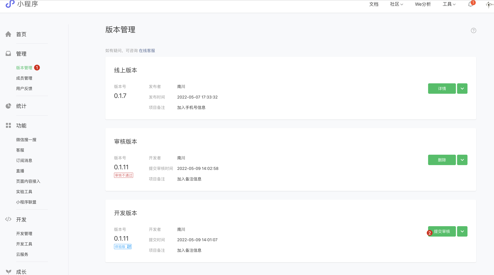

# readme

## overview

  

## framework

本项目基于`Taro Cli`的`cloud`模板搭建，基于内置的`taro-ui`搭建了小程序的界面。

具体参考：

- [安装及使用 | Taro 文档](https://taro-docs.jd.com/taro/docs/GETTING-STARTED)
- [Taro UI | O2Team](https://taro-ui.taro.zone/#/docs/quickstart)

## bugfix

1. 原先使用的是`taro-ui`模板，后来发现没有自带微信云数据库，也不太清楚怎么往微信开发工具内从0到1集成云数据库；因此使用`cloud`模板重写了一份，好在`cloud`模板内其实已经内置了`taro-ui`，但版本不兼容（需要升级到`"taro-ui": "3.0.0-alpha.3"`）
2. `taro-ui`里的组件比较少，尤其缺少`Picker`和`AtInput`联合共用的组件，因此自己写了一个组件`MyInput`用于模拟`AtInput`的UI，但不提供点击交互功能，以免引起双键盘弹起的恼人体验

## problems

### 支付转账合规问题

目前遇到的一切开发上的问题基本都有解决方案。

但遇到的合规上的问题，却不得不找替代方案，或者替代方案的替代方案。

目前最大的问题是小程序不允许开发者搜集用户的敏感信息，按层级如下：

1. 微信昵称、头像
2. 手机号、身份证号
3. 支付宝、银行卡号信息等

根据微信最新的用户协议，用户需要在【版本管理】页面"提交审核"之时，点击最后倒数一行的小字“更新当前版本的用户隐私协议”，然后声明自己的小程序需要使用微信昵称、头像、手机号等信息，才允许通过。

  

  

  

而支付宝、银行卡号等转账信息，是即使声明也无法通过审核的。

因此在小程序中试图开展支付相关的业务，只能用一个企业对公账号（至少要有一个注册公司）。
